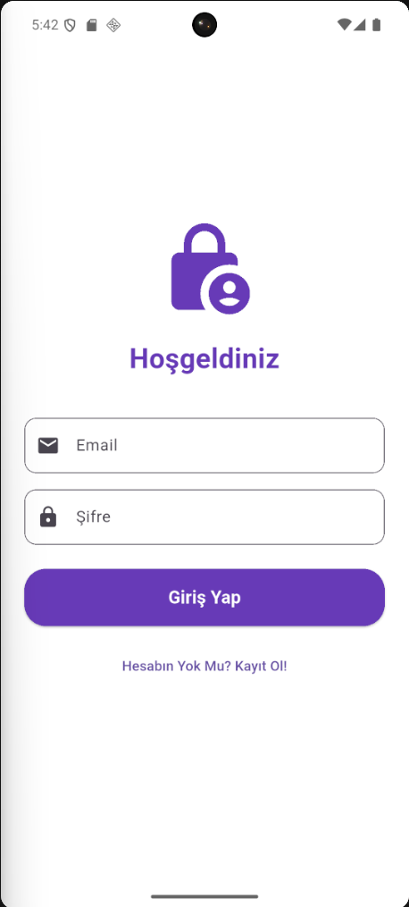
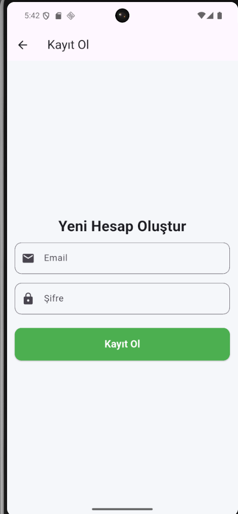
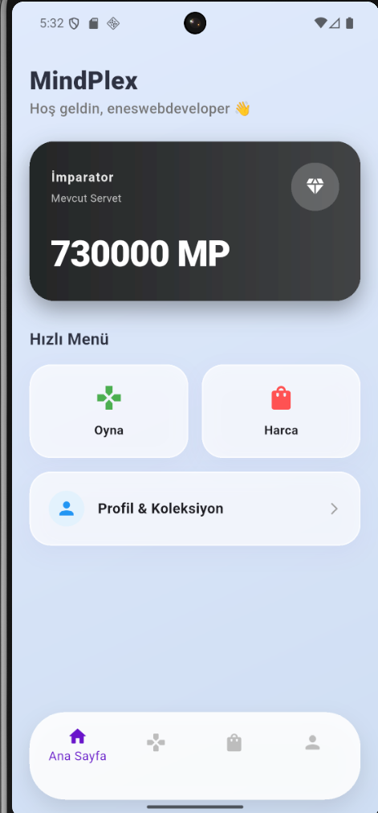
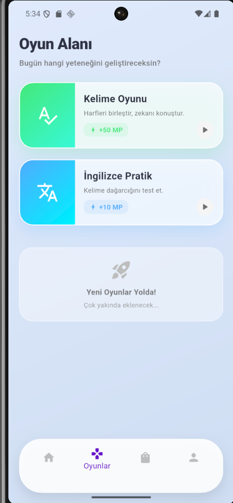
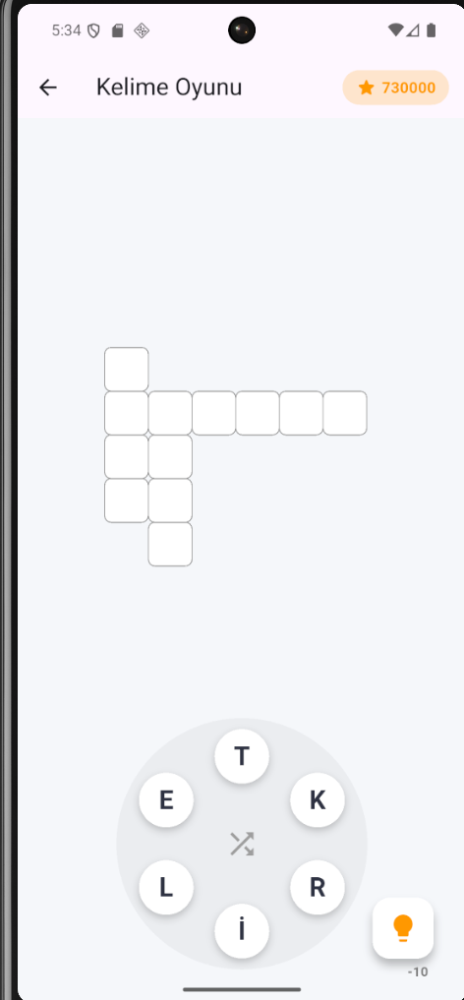
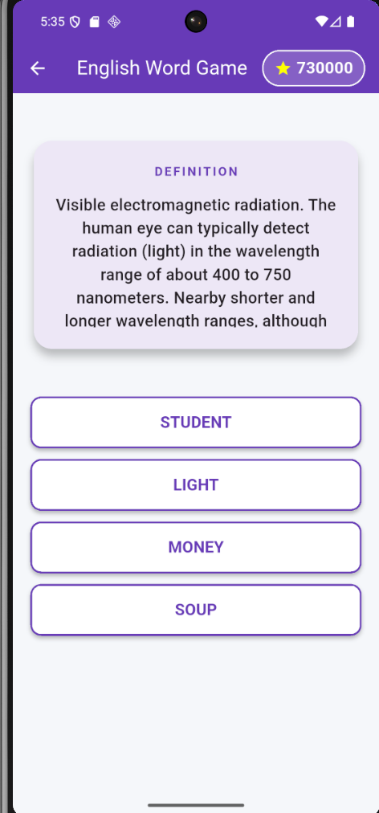
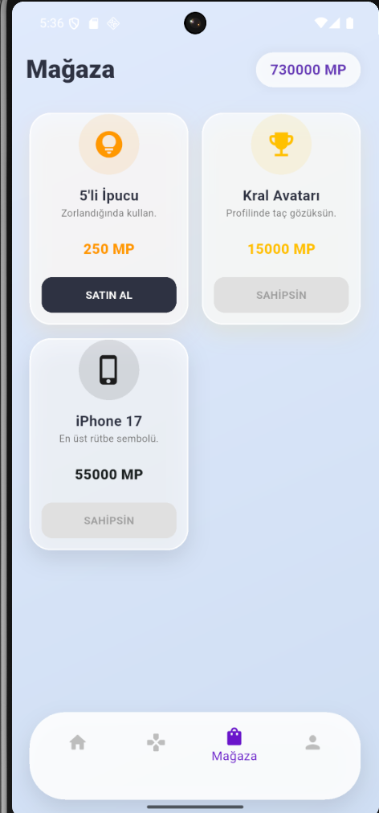
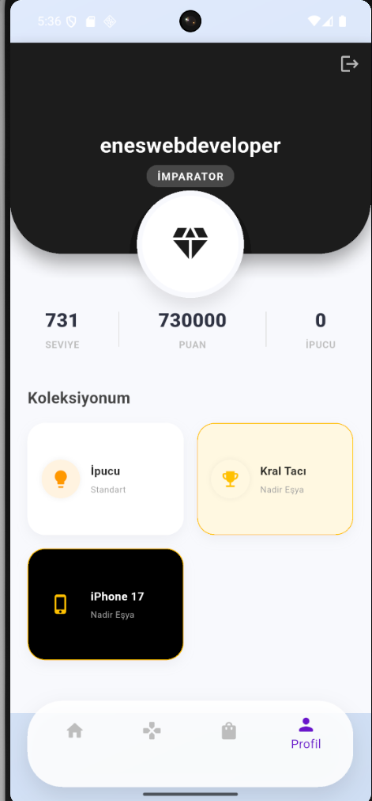

# 🧠 MindPlex - Yeni Nesil Kelime Oyunu

MindPlex, kullanıcıların kelime dağarcığını geliştirmeyi hedefleyen, oyunlaştırma ögeleriyle süslenmiş modern bir Flutter uygulamasıdır.

## 📱 Uygulama İçi Görseller

### 1. Giriş ve Karşılama
Kullanıcıların Firebase altyapısı ile güvenli bir şekilde hesap oluşturup giriş yapabildiği modern arayüzler.

| **Giriş Yap (Login)** | **Kayıt Ol (Register)** |
|:---:|:---:|
|  |  |
| E-posta ve şifre ile güvenli giriş. Hata durumunda kullanıcı dostu uyarılar. | Yeni kullanıcılar için hızlı kayıt formu. Firebase Authentication entegrasyonu. |

---gi

### 2. Ana Merkez ve Oyunlar
Glassmorphism (Buzlu Cam) tasarım diliyle hazırlanan ana kontrol paneli ve oyun seçim ekranı.

| **Dashboard (Ana Sayfa)** | **Oyun Seçimi** |
|:---:|:---:|
|  |  |
| Kullanıcının rütbesini (İmparator), puanını (MP) ve hızlı menüyü barındıran dinamik ana ekran. | Türkçe ve İngilizce oyun modlarına erişim sağlayan, renkli ve modern kart tasarımı. |

---

### 3. Oyun Deneyimi
Uygulamanın kalbi olan oyunlaştırma modülleri.

| **Kelime Bulmaca** | **İngilizce Pratik** |
|:---:|:---:|
|  |  |
| Algoritmik olarak üretilen ızgara yapısı. `CustomPainter` ile çizilen performanslı oyun alanı. | Dictionary API destekli kelime öğrenme modu. Tanıma göre doğru kelimeyi bulma. |

---

### 4. Ekonomi ve İlerleme
Kullanıcının gelişimini takip ettiği ve ödüllendirildiği sistem.

| **Mağaza (Store)** | **Profil ve Envanter** |
|:---:|:---:|
|  |  |
| Kazanılan MP'lerin harcandığı yer. Satın alınan eşyalar (iPhone 17, İpucu) "Sahipsin" olarak işaretlenir. | Kullanıcının envanterine göre şekillenen profil. Eşyalara göre değişen dinamik tema ve rütbe. |

## 🛠 Kullanılan Teknolojiler

* **Flutter & Dart**
* **Firebase:** Auth, Firestore
* **Algoritma:** Procedural Content Generation (Dinamik Bölüm Üretimi)
* **Tasarım:** Glassmorphism UI